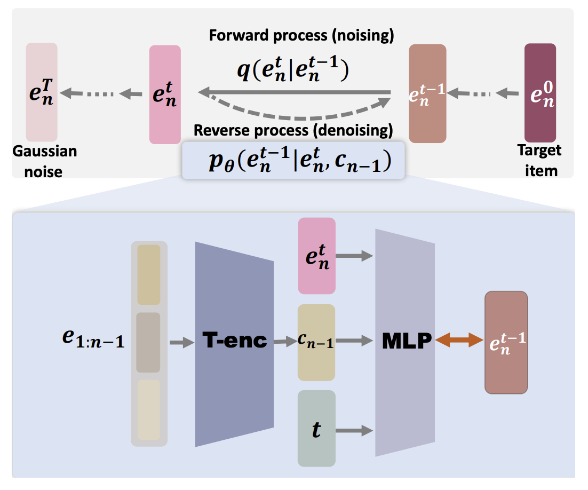








Ph.D student, [Lab of Data Science](https://data-science.ustc.edu.cn/_upload/tpl/14/90/5264/template5264/index.html), USTC

Supervisors: [Prof. Xiang Wang](https://xiangwang1223.github.io/) (王翔), [Prof. Xiangnan He](https://hexiangnan.github.io/) (何向南)

Research interest: Generative models (diffusion models, LLMs), Alignment, Preference optimization, Recommmendation.

# 💻 Internships
- *2024.05 - Now*, [WeChat](https://www.wechat.com/), Guangzhou, China.
- *2021.10 - 2022.1*, [Tencent Music Entertainment](https://www.tencentmusic.com/), Shenzhen, China.

# 🔥 News
- *2022.02*: &nbsp;🎉🎉 Lorem ipsum dolor sit amet, consectetur adipiscing elit. Vivamus ornare aliquet ipsum, ac tempus justo dapibus sit amet. 
- *2022.02*: &nbsp;🎉🎉 Lorem ipsum dolor sit amet, consectetur adipiscing elit. Vivamus ornare aliquet ipsum, ac tempus justo dapibus sit amet. 

# 📝 Publications 

NeurIPS 2023

[Generate What You Prefer: Reshaping Sequential Recommendation via Guided Diffusion](https://proceedings.neurips.cc/paper_files/paper/2023/file/4c5e2bcbf21bdf40d75fddad0bd43dc9-Paper-Conference.pdf)

**Zhengyi Yang**, Jiancan Wu, Zhicai Wang, Xiang Wang, Yancheng Yuan, Xiangnan He

[**Project**](https://scholar.google.com.sg/citations?view_op=view_citation&hl=en&user=VS_LTjMAAAAJ&citation_for_view=VS_LTjMAAAAJ:qjMakFHDy7sC) <strong></strong>
- Generating user's oracel imteraction with diffusion models, guided by user's interaction sequence.

- [Lorem ipsum dolor sit amet, consectetur adipiscing elit. Vivamus ornare aliquet ipsum, ac tempus justo dapibus sit amet](https://github.com), A, B, C, **CVPR 2020**

# 🎖 Honors and Awards
- *2021.10* Lorem ipsum dolor sit amet, consectetur adipiscing elit. Vivamus ornare aliquet ipsum, ac tempus justo dapibus sit amet. 
- *2021.09* Lorem ipsum dolor sit amet, consectetur adipiscing elit. Vivamus ornare aliquet ipsum, ac tempus justo dapibus sit amet. 

# 📖 Educations
- *2019.06 - 2022.04 (now)*, Lorem ipsum dolor sit amet, consectetur adipiscing elit. Vivamus ornare aliquet ipsum, ac tempus justo dapibus sit amet. 
- *2015.09 - 2019.06*, Lorem ipsum dolor sit amet, consectetur adipiscing elit. Vivamus ornare aliquet ipsum, ac tempus justo dapibus sit amet. 

# 💬 Invited Talks
- *2021.06*, Lorem ipsum dolor sit amet, consectetur adipiscing elit. Vivamus ornare aliquet ipsum, ac tempus justo dapibus sit amet. 
- *2021.03*, Lorem ipsum dolor sit amet, consectetur adipiscing elit. Vivamus ornare aliquet ipsum, ac tempus justo dapibus sit amet.  \| [\[video\]](https://github.com/)

# 💻 Internships
- *2019.05 - 2020.02*, [Lorem](https://github.com/), China.
